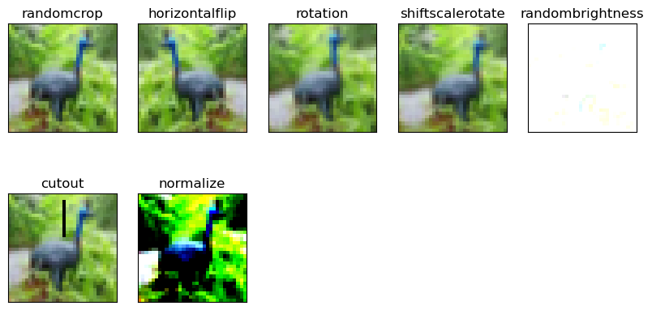
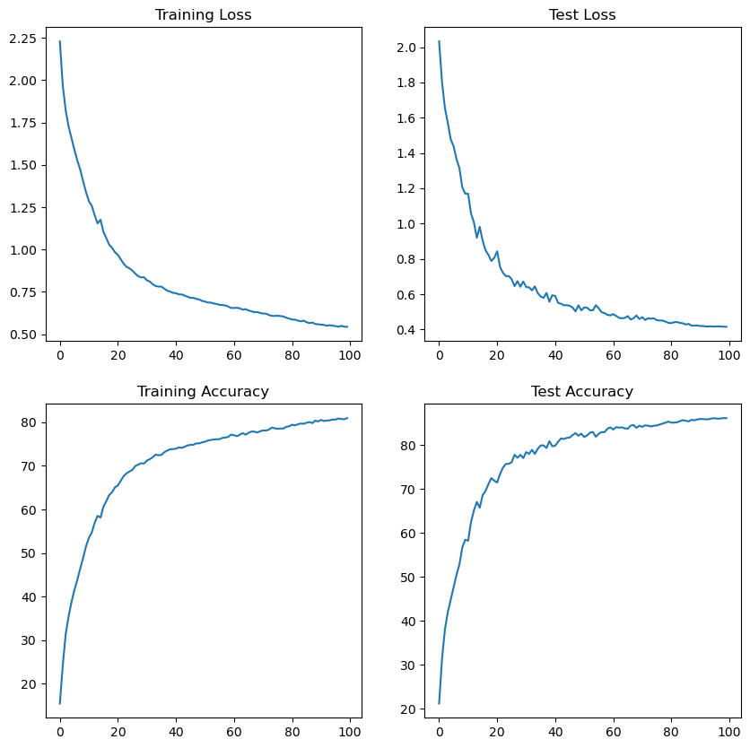
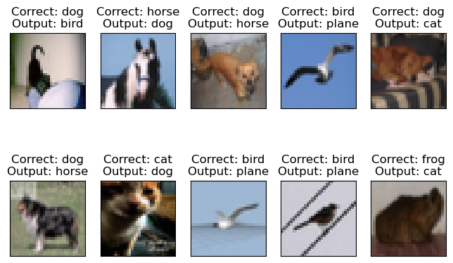

# CIFAR10 Image Classification

This repository contains a CNN model training for the CIFAR10 dataset using PyTorch, featuring dilated convolutions, depthwise separable convolutions and strided convolutions.


## Repository Structure

- `dataset.py`: Custom dataset class with [albumentations](https://github.com/albumentations-team/albumentations) integration
- `model.py`: CNN architecture with dilated convolutions
- `training_utils.py`: Training and testing utilities
- `utils.py`: Helper functions for model analysis and visualization
- `visualize.py`: Visualization tools for data, augmentations, and results
- `S8.ipynb`: Main training notebook
- `RF Calculations.xlsx`: Receptive field calculations


## Model Architecture

The model uses strided convolutions instead of traditional max pooling for downsampling. 
Key features:

- Input Size: 32x32x3
- Total Parameters: 193,535
- Techniques Used:
  - Dilated Convolutions
  - Depthwise Separable Convolutions
  - Strided Convolutions
  - Batch Normalization
  - Dropout
  - Adaptive Average Pooling

```
----------------------------------------------------------------
        Layer (type)               Output Shape         Param #
================================================================
            Conv2d-1            [-1, 3, 32, 32]              27
            Conv2d-2           [-1, 32, 32, 32]              96
              ReLU-3           [-1, 32, 32, 32]               0
       BatchNorm2d-4           [-1, 32, 32, 32]              64
           Dropout-5           [-1, 32, 32, 32]               0

            Conv2d-6           [-1, 32, 32, 32]           9,216
              ReLU-7           [-1, 32, 32, 32]               0
       BatchNorm2d-8           [-1, 32, 32, 32]              64
           Dropout-9           [-1, 32, 32, 32]               0

           Conv2d-10           [-1, 32, 32, 32]           9,216
             ReLU-11           [-1, 32, 32, 32]               0
      BatchNorm2d-12           [-1, 32, 32, 32]              64
          Dropout-13           [-1, 32, 32, 32]               0

           Conv2d-14           [-1, 32, 16, 16]           9,216
             ReLU-15           [-1, 32, 16, 16]               0
      BatchNorm2d-16           [-1, 32, 16, 16]              64
          Dropout-17           [-1, 32, 16, 16]               0

           Conv2d-18           [-1, 32, 16, 16]             288
           Conv2d-19           [-1, 40, 16, 16]           1,280
             ReLU-20           [-1, 40, 16, 16]               0
      BatchNorm2d-21           [-1, 40, 16, 16]              80
          Dropout-22           [-1, 40, 16, 16]               0

           Conv2d-23           [-1, 40, 16, 16]          14,400
             ReLU-24           [-1, 40, 16, 16]               0
      BatchNorm2d-25           [-1, 40, 16, 16]              80
          Dropout-26           [-1, 40, 16, 16]               0

           Conv2d-27           [-1, 40, 16, 16]          14,400
             ReLU-28           [-1, 40, 16, 16]               0
      BatchNorm2d-29           [-1, 40, 16, 16]              80
          Dropout-30           [-1, 40, 16, 16]               0

           Conv2d-31             [-1, 40, 8, 8]          14,400
             ReLU-32             [-1, 40, 8, 8]               0
      BatchNorm2d-33             [-1, 40, 8, 8]              80
          Dropout-34             [-1, 40, 8, 8]               0

           Conv2d-35             [-1, 40, 8, 8]             360
           Conv2d-36             [-1, 44, 8, 8]           1,760
             ReLU-37             [-1, 44, 8, 8]               0
      BatchNorm2d-38             [-1, 44, 8, 8]              88
          Dropout-39             [-1, 44, 8, 8]               0

           Conv2d-40             [-1, 44, 8, 8]          17,424
             ReLU-41             [-1, 44, 8, 8]               0
      BatchNorm2d-42             [-1, 44, 8, 8]              88
          Dropout-43             [-1, 44, 8, 8]               0

           Conv2d-44             [-1, 44, 8, 8]          17,424
             ReLU-45             [-1, 44, 8, 8]               0
      BatchNorm2d-46             [-1, 44, 8, 8]              88
          Dropout-47             [-1, 44, 8, 8]               0

           Conv2d-48             [-1, 44, 4, 4]          17,424
             ReLU-49             [-1, 44, 4, 4]               0
      BatchNorm2d-50             [-1, 44, 4, 4]              88
          Dropout-51             [-1, 44, 4, 4]               0

           Conv2d-52             [-1, 44, 4, 4]             396
           Conv2d-53             [-1, 48, 4, 4]           2,112
             ReLU-54             [-1, 48, 4, 4]               0
      BatchNorm2d-55             [-1, 48, 4, 4]              96
          Dropout-56             [-1, 48, 4, 4]               0

           Conv2d-57             [-1, 48, 4, 4]          20,736
             ReLU-58             [-1, 48, 4, 4]               0
      BatchNorm2d-59             [-1, 48, 4, 4]              96
          Dropout-60             [-1, 48, 4, 4]               0

           Conv2d-61             [-1, 48, 4, 4]          20,736
             ReLU-62             [-1, 48, 4, 4]               0
      BatchNorm2d-63             [-1, 48, 4, 4]              96
          Dropout-64             [-1, 48, 4, 4]               0

           Conv2d-65             [-1, 48, 4, 4]          20,736
             ReLU-66             [-1, 48, 4, 4]               0
      BatchNorm2d-67             [-1, 48, 4, 4]              96
          Dropout-68             [-1, 48, 4, 4]               0

AdaptiveAvgPool2d-69             [-1, 48, 1, 1]               0
      BatchNorm2d-70             [-1, 48, 1, 1]              96

           Conv2d-71             [-1, 10, 1, 1]             480
================================================================
Total params: 193,535
Trainable params: 193,535
Non-trainable params: 0
----------------------------------------------------------------
Input size (MB): 0.01
Forward/backward pass size (MB): 4.75
Params size (MB): 0.74
Estimated Total Size (MB): 5.50
----------------------------------------------------------------
```

### [Receptive Field Calculations](./CIFAR10-RF%20Calculations.xlsx)

## Dataset Analysis

### Statistics
```
[Train]
 - Total Train Images: 50000
 - Tensor Shape: (3, 32, 32)
 - min: (0.0, 0.0, 0.0)
 - max: (1.0, 1.0, 1.0)
 - mean: (0.49139968, 0.48215827, 0.44653124)
 - std: (0.24703233, 0.24348505, 0.26158768)
 - var: (0.061024975, 0.05928497, 0.06842812)
[Test]
 - Total Test Images: 10000
 - Tensor Shape: (3, 32, 32)
 - min: (0.0, 0.0, 0.0)
 - max: (1.0, 1.0, 1.0)
 - mean: (0.49421427, 0.48513183, 0.45040932)
 - std: (0.24665256, 0.24289224, 0.26159248)
 - var: (0.06083748, 0.058996636, 0.06843062)
```

## Data Augmentation

The following augmentations were applied during training:


## Training Results

- Epochs: 100
- Target Accuracy: 85%
- Training Logs for last few logs:
```
Epoch 95
Train: Loss=0.5880 Batch_id=48 Accuracy=80.65: 100%|██████████| 49/49 [00:12<00:00,  3.97it/s]
Test set: Average loss: 0.4169, Accuracy: 8611/10000 (86.11%)

Epoch 96
Train: Loss=0.4835 Batch_id=48 Accuracy=80.63: 100%|██████████| 49/49 [00:12<00:00,  3.90it/s]
Test set: Average loss: 0.4163, Accuracy: 8615/10000 (86.15%)

Epoch 97
Train: Loss=0.5488 Batch_id=48 Accuracy=80.89: 100%|██████████| 49/49 [00:12<00:00,  3.82it/s]
Test set: Average loss: 0.4176, Accuracy: 8602/10000 (86.02%)

Epoch 98
Train: Loss=0.5908 Batch_id=48 Accuracy=80.76: 100%|██████████| 49/49 [00:12<00:00,  3.93it/s]
Test set: Average loss: 0.4164, Accuracy: 8610/10000 (86.10%)

Epoch 99
Train: Loss=0.5170 Batch_id=48 Accuracy=80.73: 100%|██████████| 49/49 [00:12<00:00,  3.89it/s]
Test set: Average loss: 0.4158, Accuracy: 8617/10000 (86.17%)

Epoch 100
Train: Loss=0.5167 Batch_id=48 Accuracy=80.97: 100%|██████████| 49/49 [00:12<00:00,  3.99it/s]
Test set: Average loss: 0.4149, Accuracy: 8615/10000 (86.15%)
```



### Misclassified Examples:



## Usage

1. Install dependencies
2. Run the training notebook `S9.ipynb`
3. Use the trained model for predictions
